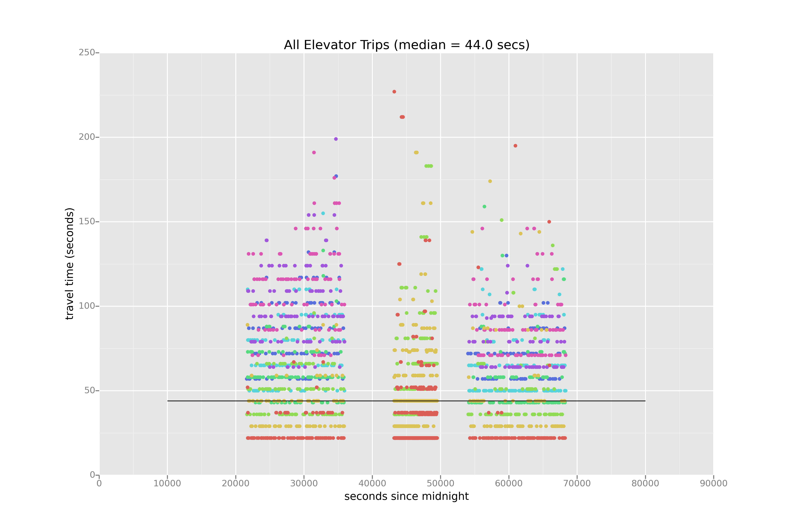
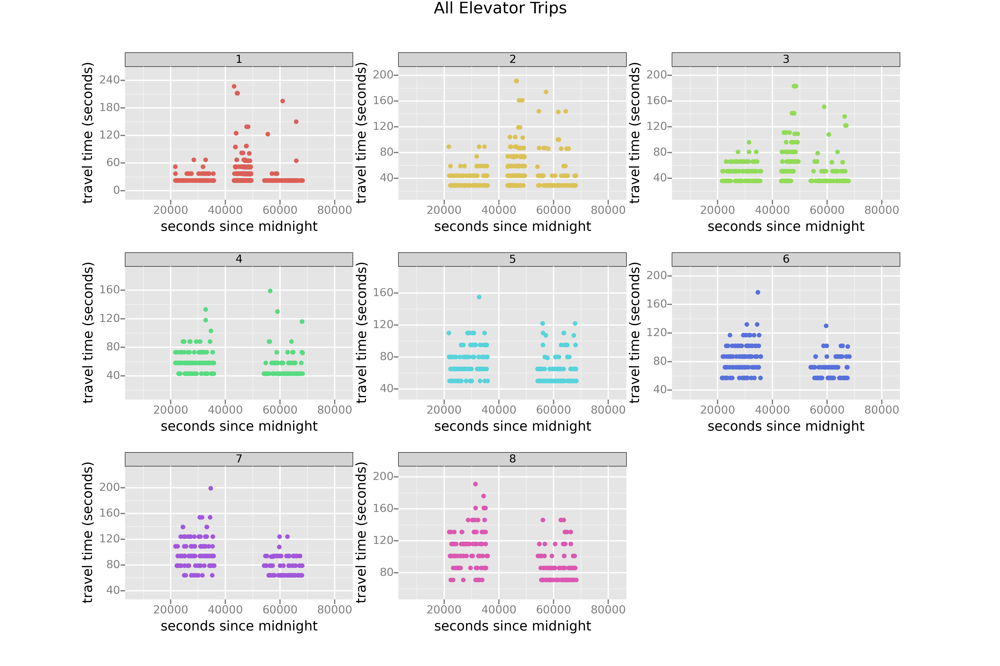

# Elevator Simulation

## About / Motivations

This is an small simulation project intended to model an elevator system in an office building. It was originally created to settle a question about elevator efficency during a set of upgrades at the office. The basic question: when multiple independent elevator banks exist, is it better to call multiple elevator banks or randomly select one? This project was completed to the extent needed to satisfy the original and subsequent inquiries. 

This simulation is freely available to anyone. Contributions are appreciated but not required.

## Requirements

* Python 3.4+
* Everything in requirements.txt (simpy, pandas, ggplot and more)

## What's Included

The project consists of a number of tools and modules, including:

* `elevator_simulation` a reasonably documented python package for creating a representation of a simulation environment in `simpy`
* scripts to generate simulation json files, run the simulation and generate trip data output, and plot generation scripts using ggplot and pandas
* scripts for running unit tests, generating data from input simulations that are generated apriori

## How Run

If you want to generate data, you can run `generate_simulation.py` to create a json file modeling a simulation. `generate_data.sh` provides an example of running the simulation scripts and generating plots. It should work out of the box with the provided simulation files.

## Sample Plots

*Time Spent In Traveling In Elevators*

_Time Spent In Traveling In Elevators By Distance Traveled In Floors_

## License

`elevator_simulation` is licensed under CC0, or public domain in all jursidictions that permit it.
